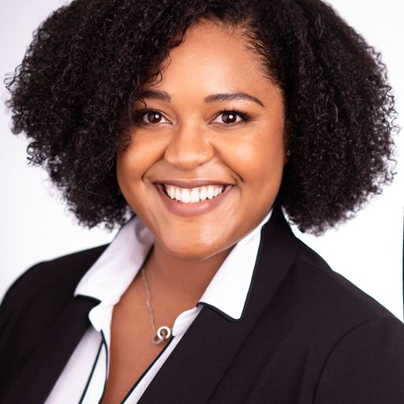
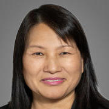

# DATAS

Welcome to the Data Alignment and Tutoring Assessment Standards (DATAS)! Here's what we do:
1. We define the technical standard for tutoring data interoperability between schools, districts, providers, and platforms.
1. We provide an easily adaptable, universally adoptable framework for collecting and sharing tutoring implementation data.
1. We create tools that  leverage the data standard in practical ways (dashboards, analyses, model regulations, template DSAs).

Feel free to read more about us below, or jump straight to the [quick start](#quick-start)!

## Table of Contents

1. [Mission Statement](#mission-statement)
1. [Governance](#governance)
1. [Steering Committee](#steering-committee)
1. [Quick Start](#quick-start)
1. [Contributions](#contributions)

## Mission Statement
Students in public school systems across the United States deserve the full benefits of high-dosage tutoring programs. Despite over 1.4 billion dollars of ESSER funding being spent on high-dosage tutoring, there is insufficient data to evaluate success or identify areas for improvement. If this problem continues, the potential educational benefits of high-dosage tutoring will not be fully realized, potentially resulting in continued learning loss and widening achievement gaps. 

We have the power to unlock the potential of these programs by standardizing how we measure success. 

To test our hypothesis, we will collaborate with educational researchers, providers, school districts, and philanthropies to create policy-ready frameworks for tracking and reporting the implementation and outcomes of high-dosage tutoring in a uniform way. Imagine a future where every dollar invested in tutoring translates into tangible gains for our students.

---

## Governance

### Steering committee

The steering commitee is an invitation-only group that meets monthly to direct DATAS. The steering committee has at least one member from each major constituency: provider/platform, SEA/LEA, researcher/philanthropy. Any contributor with an accepted pull request will be invited to the steering committee.

### Working Groups

The working groups are open enrollment meetings that work broadly to accomplish the goals laid out by the steering committee. The number of groups and their goals will shift over time. Currently, there are three working groups:
1. Technical: make the data standard *work*
1. Go-to-market: foments conditions for success after alpha testing concludes
1. Alpha testing: tests the data standard in a real environment

---
## Steering Committee
<!-- generate from steering_committee.py -->
<table>
    <thead>
        <tr>
            <th>Steering Committee Members</th>
            <th></th>
            <th></th>
        </tr>
    </thead>
    <tbody>
        <tr>
            <td align="center">
                 
                <strong>Britta Tremblay</strong> 
                <em>VP of Product</em> 
                Littera
            </td>
            <td align="center">
                 
                <strong>Jennifer Bronson</strong> 
                <em>Managing Director of Programs</em> 
                Accelerate
            </td>
            <td align="center">
                 
                <strong>Jason Godfrey</strong> 
                <em>Director of Data Science</em> 
                Accelerate
            </td>
        </tr>
        <tr>
            <td align="center">
                 
                <strong>Dr. Brent Raby</strong> 
                <em>Associate Superintendent</em> 
                West Aurora SD 129
            </td>
            <td align="center">
                 
                <strong>Fatemeh Momeni</strong> 
                <em>Research Director</em> 
                University of Chicago Education Lab
            </td>
            <td align="center">
                 
                <strong>John Failla</strong> 
                <em>CEO & Founder</em> 
                Pearl
            </td>
        </tr>
        <tr>
            <td align="center">
                 
                <strong>Justin Serrano</strong> 
                <em>CEO</em> 
                Littera
            </td>
            <td align="center">
                 
                <strong>Nate Casey</strong> 
                <em>Chief Strategy Officer</em> 
                Pearl
            </td>
            <td align="center">
                 
                <strong>Nicole Carmichael</strong> 
                <em>Integrated Data System Manager</em> 
                Delaware DoE
            </td>
        </tr>
        <tr>
            <td align="center">
                 
                <strong>Shani Young</strong> 
                <em>Director of Learning</em> 
                North Carolina Education Corps
            </td>
            <td align="center">
                 
                <strong>Spencer Ellis</strong> 
                <em>Grant Program Manager</em> 
                CO DoE
            </td>
            <td align="center">
                 
                <strong>Zhanying Zong</strong> 
                <em>Director, Assessment & Accountability</em> 
                LA DoE
            </td>
        </tr>
    </tbody>
</table>
<!-- generate from steering_committee.py -->

---
## Documentation

---

## Quick Start

---

## Contributions
We welcome contributions! Feel free to open issues or submit pull requests. For major changes, please open an issue first to discuss what you would like to change.

This project is licensed under the MIT License - see the [LICENSE](LICENSE) file for details.

<!-- 29df1c1e-8fcc-4b30-88df-2365d9d8e9c8 -->